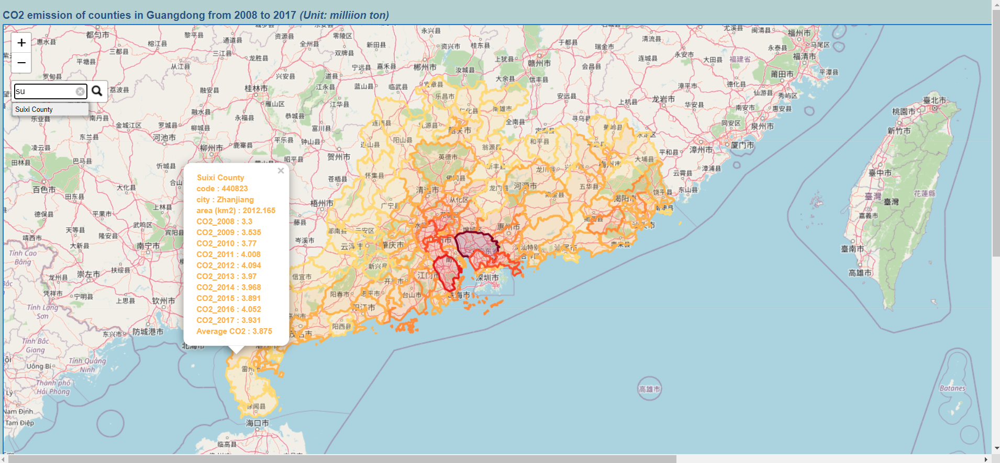

# CO2 Emission in Guangdong, China.
Demonstration of an ETL, API, and Data Visualization Processes using CO2 Emission Data of Guangdong Province in China.

<!-- ABOUT THE PROJECT -->
<h2>1. Introduction</h2>

China aims at reaching the peak of CO2 emissions before 2030. Due to the regional development differences and industrial divisions, the CO2 emissions vary from regions. Therefore, mapping and visualizing the CO2 emissions is important for better understanding the emission pattern and making decisions for cutting emissions depending on different conditions.  
This project demonstrates the ETL, API, and Visualization processes using the Guangdong Province Co2 Emission data from the year 2008 to 2017 which was obtained from the Carbon Emission Accounts & Datasets (CEADs) for emerging economies web <a href ="https://www.ceads.net/" target = "_blank">platform</a>.

<!-- PROCEDURES -->
<h2>2. Procedures</h2>

<h3>ETL</h3>
This process entails the creation of an algorithm that carries out the extraction, transformation, and Loading of the Co2 Emission data into a PostgreSQL database. The extraction of the data was carried out from a local folder after the data was downloaded in a csv fomat as there was no direct link to extract the data directly from the data platform. A transformation was carried out in order to clean the data into an acceptable format for upload into the database. The cleaned dataframe was merged into the shapefile of the counties before loading it as a GepJSON file into the PostgresSQL database.

<h3>API</h3>
For the Application Programming Interface (API), an algorithm was developed using the Python programming language, to get/retrieve information from the database to external users who seek to obtain allowable data, and return the results in a json format. 

<h3>Visualization</h3>
Leaflet is used for making the interactive map. A map displaying co2 emission of 120 counties in Guangdong is shown in the webpage. The information of county name, city name, area, co2 emission in different years and average emission are in the pop-up window when users click or search the counties.
 
 

<!-- DATABASE -->
<h2>3. Database</h2>
A Database named Co2Emission was created in the PostgreSQL using the PgAdmin platform. An SQL code was designed to create a table in the public schema of the database for reception of the cleaned data that will be loaded automatically from the ETL process. The data, after cleaning was loaded in the PostgreSQL PostGIS using the python code.
 
 
 

Table 1. Sample of Data Loaded into Database Through ETL Process

| county_code_x |   county_name   | city_name | area_sqkm |   Northing  |   Easting  | co2_2008 | co2_2009 | ... | co2_2017 | min_co2 | max_co2 | avg_co2 | total_co2 |
|:-------------:|:---------------:|:---------:|:---------:|:-----------:|:----------:|:--------:|:--------:|:---:|:--------:|:-------:|:-------:|:-------:|:---------:|
|     440103    |  Liwan District | Guangzhou |    62.4   | 2438165.986 | 846549.802 |   1.503  |   1.607  | ... |   1.595  |  1.595  |   1.81  |   1.69  |   16.901  |
|     440104    | Yuexiu District | Guangzhou |   33.673  | 2443576.728 | 851638.097 |    0.8   |   0.855  | ... |   0.839  |  0.839  |  0.964  |  0.895  |   8.949   |
|      ...      |       ...       |    ...    |    ...    |     ...     |     ...    |    ...   |    ...   | ... |    ...   |   ...   |   ...   |   ...   |    ...    |
|     440106    | Tianhe District | Guangzhou |  136.156  | 2447316.157 | 861104.607 |   3.023  |   3.232  | ... |   3.206  |  3.206  |  3.642  |  3.396  |   33.958  |
|     440111    | Baiyun District | Guangzhou |  666.733  | 2461144.405 | 854546.765 |   9.425  |  10.076  | ... |  10.004  |  10.004 |  11.469 |  10.653 |  106.528  |

<h2>4. Map View Window</h2>
This is an interactive map view window co2 emissions information can be obtained for each of the counties.
 
 

Link：https://linbing1065.github.io/

<!-- AUTHORS -->
<h2>5. Authors</h2>
<b>Linbing Zhuang</b> 
Master's degree in Geospatial Technologies at <a href ="https://www.novaims.unl.pt/" target = "_blank">NOVA University of Lisbon</a>, <a href ="https://www.uni-muenster.de/en/" target = "_blank">WWU Münster</a> and <a href ="https://www.uji.es/" target = "_blank">UJI</a> 

<b>Egboka Philip Ifeanyi</b> 
Master's degree in Geospatial Technologies at <a href ="https://www.novaims.unl.pt/" target = "_blank">NOVA University of Lisbon</a>, <a href ="https://www.uni-muenster.de/en/" target = "_blank">WWU Münster</a> and <a href ="https://www.uji.es/" target = "_blank">UJI</a> 

<b>Tochukwu Emmanuel Amaeze</b> 
Master's degree in Geospatial Technologies at <a href ="https://www.novaims.unl.pt/" target = "_blank">NOVA University of Lisbon</a>, <a href ="https://www.uni-muenster.de/en/" target = "_blank">WWU Münster</a> and <a href ="https://www.uji.es/" target = "_blank">UJI</a> 
